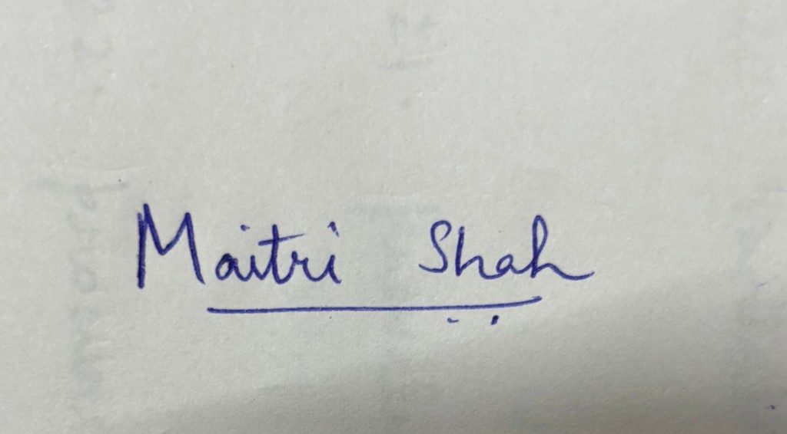

# AI Usage Disclosure Form

## 1. Team Details

Team Name: smoothOperator

Project / Product Name: Interra — Theme 05 interruptible real-time agent

Organization / Institution: VITV

Submission Date: 30 September 2026

Repository: [https://github.com/Maitri-shah29/Interra](https://github.com/Maitri-shah29/Interra)

## 2. AI Usage Declaration

Did your team use any Artificial Intelligence (AI) in developing this project? Yes

Cursor coding agents and OpenAI Codex were used throughout implementation, testing, documentation, and benchmark diagnosis.

## 3. Purpose of AI Usage

Idea generation / brainstorming: Used to interpret the Theme 05 kit and the later Full-Duplex-Bench v3 guide, and to turn those requirements into an implementation plan. The theme, scoring rules, and official tool list came from the organizers.

Code generation or assistance: Used for the coordination runtime, the LiveKit FDB-v3 agent, speech-provider changes, Kaggle packaging and the camera session.

UI / UX design: Not used. This submission does not include a product interface or an APK.

Content creation: Used for README text, status notes, the demo sequence and the slide outline. Measured scores were copied from official reports, not invented.

Data analysis: Used to read Kaggle logs and the official reports. Best completed run: 31/100 strict pass, 58/100 turn-take, and 4.545 second average response latency, using LiveKit Inference speech and GPT-4.1 mini. An earlier Qwen 3 8B run also scored 31/100 strict pass and 52/100 turn-take.

Testing / debugging: Used to add regression tests and to diagnose silent runs, ElevenLabs HTTP 401, the nested-entrypoint crash, and the recording-window timing failure.

Other: Used to compare this repository with the public FDB-v3 runner. The official mock backend and evaluators are unchanged; adapter wrappers normalize speech arguments and forward supported optional parameters.

## 4. Feature Origin Classification

1. Feature Name: Interruptible coordination runtime
2. Self-Generated/AI-Generated/Both: Both
3. Description: The fast path, slow path, and coordination layer come from the Theme 05 requirements and the existing repository design. Cursor agents implemented and tested cancellation, stale-result rejection, and duplicate protection under team direction. Prompts were task instructions such as implementing the runtime and adding a regression test for each orchestration bug. Output was Python modules and unit tests. The team kept the design constraints: no global session state, schema-validated model output, and explicit tool call IDs.

1. Feature Name: FDB-v3 LiveKit voice agent
2. Self-Generated/AI-Generated/Both: Both
3. Description: The evaluation method, 12 tools, and cascaded LiveKit shape come from the official FDB-v3 kit. Cursor agents wrote `agent.fdb_livekit` and the benchmark runner. Speech moved from ElevenLabs to LiveKit Inference Deepgram Nova-3 and Cartesia Sonic-3 after the ElevenLabs key returned HTTP 401. The default tool-calling model is LiveKit Inference GPT-4.1 mini, with Ollama Qwen 3 8B as a fallback. Prompts were directions to fix silence, switch speech providers, and prepare the Kaggle notebook. Output was the adapter, timing changes, and tests. The pinned official evaluator was not modified. The best completed official result is 31/100 strict pass and 58/100 turn-take.

1. Feature Name: Camera-assisted troubleshooting
2. Self-Generated/AI-Generated/Both: Both
3. Description: The extension topic comes from the hackathon requirement. Cursor agents and Codex implemented a separate LiveKit session, `python -m agent.extension_livekit start`, which attaches the linked participant's latest camera frame to the next spoken turn and does not add benchmark tools. Prompts requested the extension and submission audit while the Kaggle notebook kept running. Output was the session module and ten unit tests, including cleanup, participant isolation and stale-image regressions. A live end-to-end recording is still required before this feature is demonstrated.

## 5. Ethical & Compliance Confirmation

AI usage complies with guidelines and policies. Yes

No proprietary or copyrighted data misused. I Agree

## 6. Declaration & Sign-Off

Name of Team Representative: Maitri Shah

Role: Primary member

Signature:

Date: 30 September 2026

