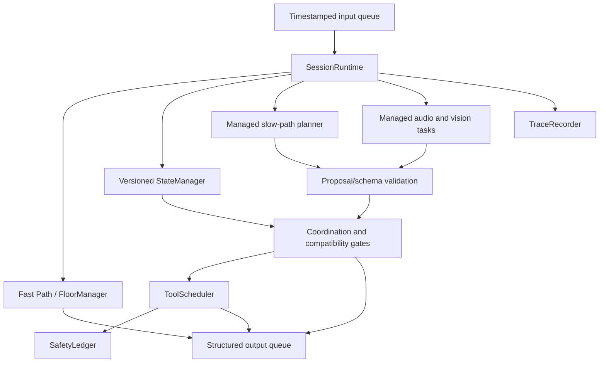

# Architecture

## Control-plane split

The Fast Path emits one semantically relevant, non-completion acknowledgment without waiting
for the Slow Path. The Slow Path proposes state patches, tools, clarifications or final text.
The coordination layer alone mutates canonical state, dispatches tools, invalidates work and
accepts results.

## Serialized state, concurrent work

One `SessionRuntime` owns each session's queues, immutable state snapshots, task registry,
call registry, safety ledger and trace. Provider and timer coroutines never mutate those
objects directly. They return typed completion messages through the input mailbox, where one
consumer serializes every transition.

Every spawned task is registered. Shutdown cancels and gathers all owned tasks in `finally`;
`CancelledError` is re-raised inside provider work.

## Interruption and stale-result invariant

Calls capture their originating state snapshot and explicit argument-to-slot bindings.
After a semantic patch:

1. The state manager atomically computes the new version and changed keys.
2. The scheduler checks intent and bound-slot compatibility.
3. Invalid dispatched calls become `CANCEL_REQUESTED` and emit a cancellation action.
4. Their late results enter the single acceptance gate and are traced as
   `STALE_RESULT_DISCARDED`.
5. Only calls compatible with the current canonical snapshot may trigger more planning.

An explicit interruption invalidates active work immediately while waiting for the semantic
correction. A pending-user barrier prevents a racing old result from starting obsolete
planning.

## Side-effect safety

`call_id` identifies a transport attempt. `operation_key` identifies the logical write.
Before emitting a state-modifying call, `SafetyLedger` atomically reserves both the requested
operation key and a canonical tool/argument fingerprint. Duplicate proposals are blocked even
if they supply different keys. A failure, timeout or cancellation after dispatch produces
`OUTCOME_UNKNOWN`; the runtime never retries that write blindly.

## Multimodal provenance

WAV and PNG work uses separately owned tasks within a semantic epoch. The latest source of
each modality is accepted only if its source event, modality and epoch remain current.
Accepted observations carry source event IDs and timestamps into one planner context. Newer
text or interruption invalidates obsolete perception work, while complementary audio and
vision may complete concurrently.

## Determinism and protocol isolation

Core deadlines use an injected `Clock`. `VirtualClock` orders equal deadlines by insertion
sequence and requires explicit advancement. Protocol validation and serialization are confined
to `LocalProtocol`; the missing official Samsung adapter can map external field names without
rewriting domain or concurrency logic.

## Trace evidence

Traces include input receipt/queue latency, first response latency, planner lifecycle, state
before/after, call dispatch/invalidation/cancellation, result acceptance/rejection, write
duplicate blocking, provider failures and final actions. `agent.metrics.analyze_trace` derives
local latency and invariant counters without inventing an official score.
